# Vision-I

Vision-I is an intelligence operations platform for monitoring live events, assets, signals, narratives, and geopolitical developments from multiple open-source feeds. It combines a .NET API, a Blazor web interface, and a Python intelligence layer backed by PostgreSQL, Redis, and Neo4j.

The application is designed for analysts who need a single operational workspace for map-based monitoring, graph exploration, source triage, copilot-assisted investigation, and report generation.

## Highlights

- Live event ingestion and enrichment from multiple source adapters.
- Interactive intelligence map with asset, event, and regional context.
- Entity, narrative, signal, sentiment, and threat-board views.
- Workspace-driven investigation flow with evidence, developments, entities, social context, and reports.
- Copilot and agent-oriented analysis workflows.
- Graph exploration powered by Neo4j-backed relationship storage.
- PostgreSQL persistence with pgvector support for intelligence records and operational data.
- Redis-backed cache and event distribution.
- Docker Compose stack for running the full platform locally or on a server.

## Screenshots

### Operational Overview

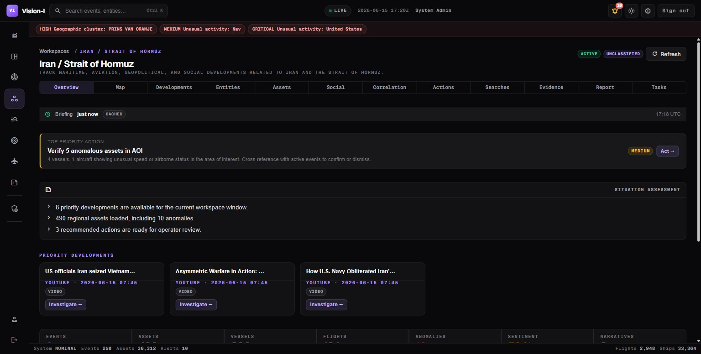

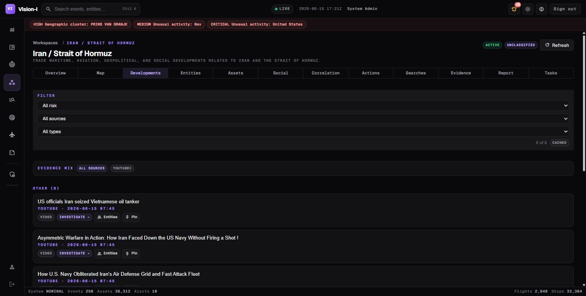

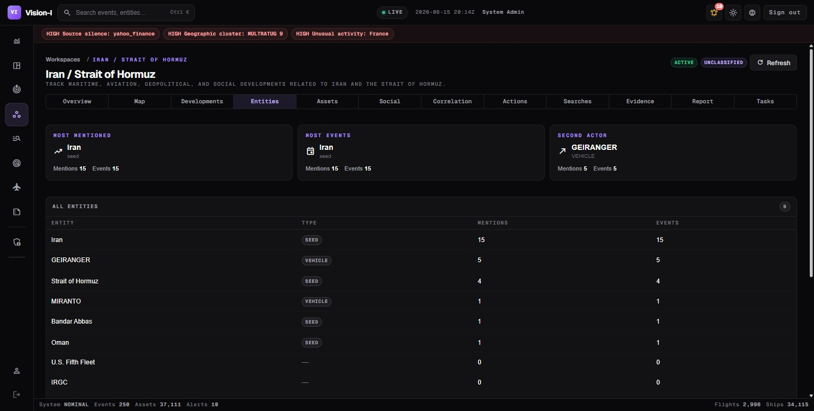

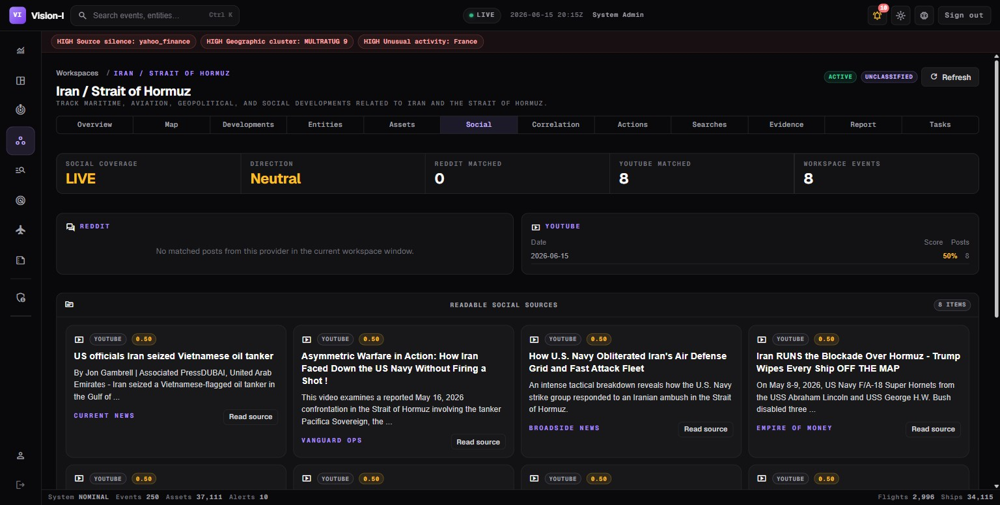

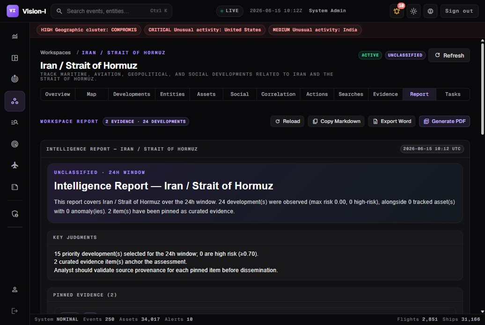

### Evidence, Maps, and Exploration

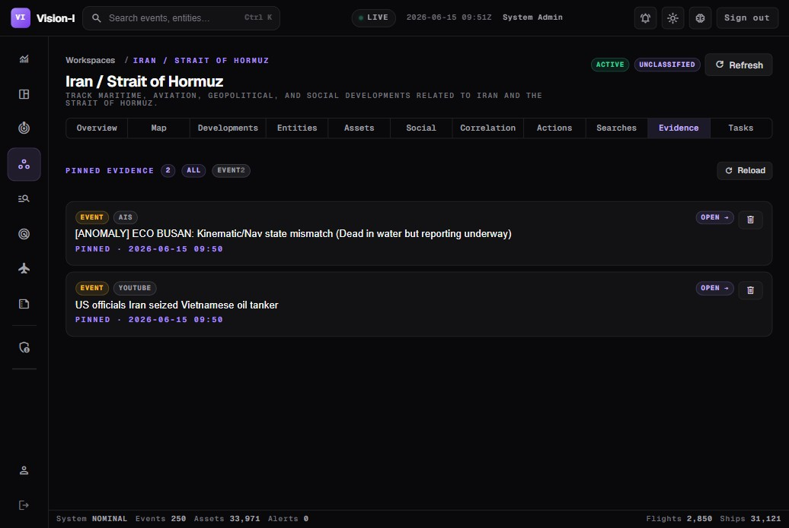

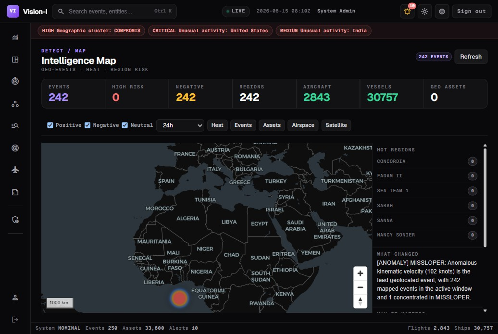

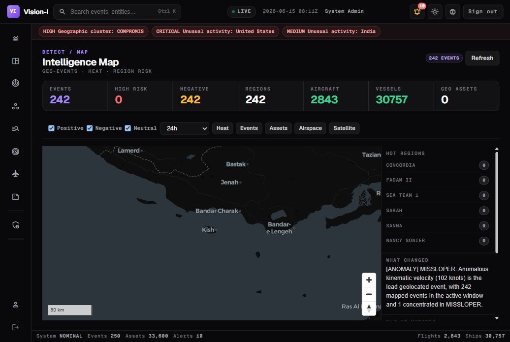

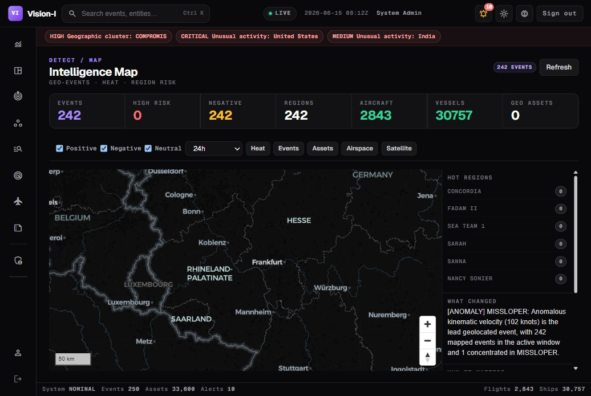

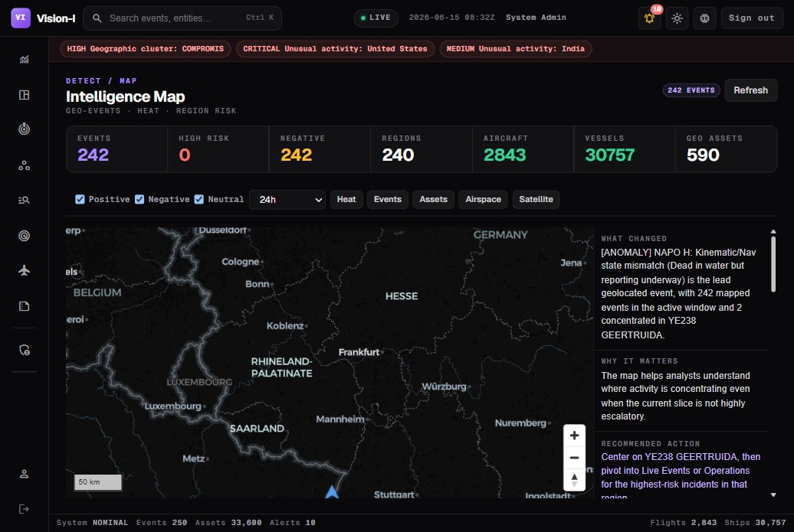

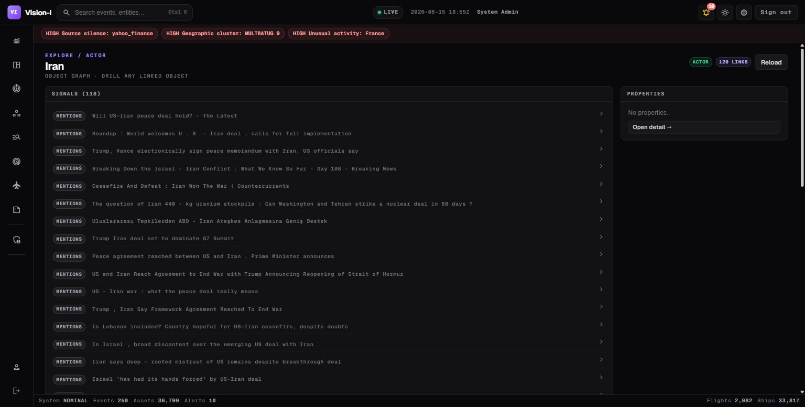

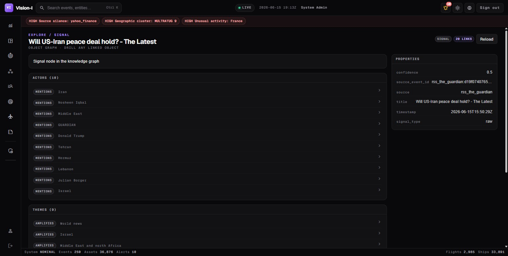

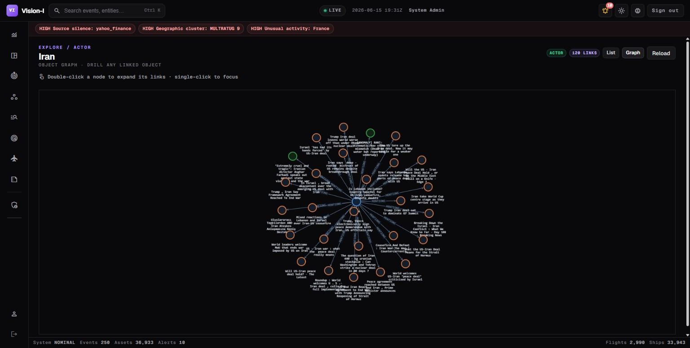

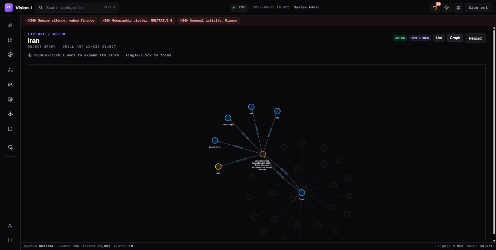

### Copilot

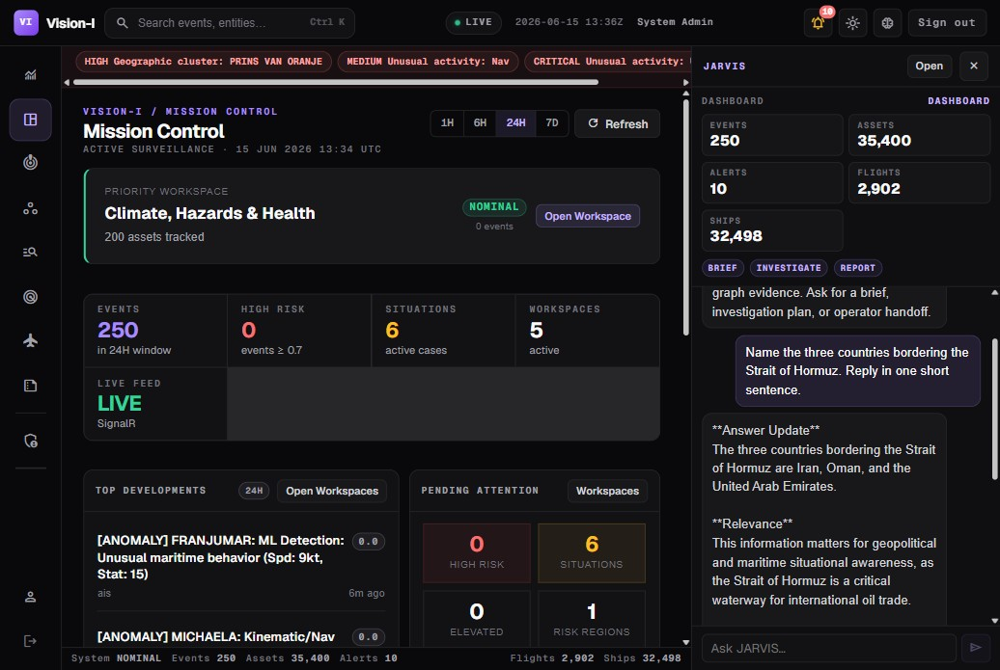

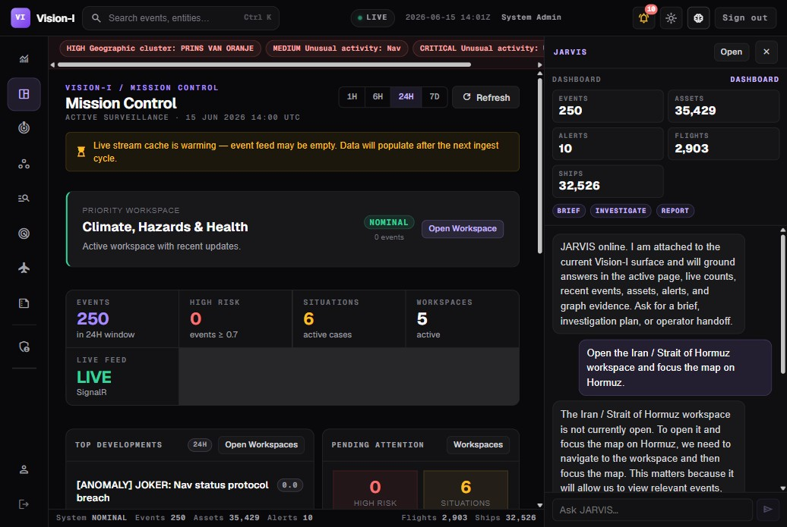

## Architecture

Vision-I is split into three application layers and three infrastructure services.

| Component | Path | Purpose |
| --- | --- | --- |
| Blazor web app | `dotnet/VisionI.Web` | Analyst-facing UI, pages, workspace views, charts, maps, and browser-side workflows. |
| .NET API | `dotnet/VisionI.API` | Authentication, application API, proxy layer, workspaces, triage, SignalR hubs, and orchestration with Python services. |
| Python API and worker | `python` | FastAPI intelligence service, source extractors, enrichment, scheduler, NLP, graph storage, and background pipelines. |
| PostgreSQL + pgvector | Docker service | Relational persistence and vector-capable storage. |
| Redis | Docker service | Cache, pub/sub, and event distribution support. |
| Neo4j | Docker service | Graph relationships, entity/event networks, and ontology-backed exploration. |

## Repository Layout

```text
.
|-- docker-compose.yml          # Full production-style stack
|-- docker-compose.prod.yml     # Production override/scaling profile
|-- .env.example                # Environment variable template
|-- dotnet/
|   |-- Vision-I.sln
|   |-- VisionI.API/            # .NET API service
|   `-- VisionI.Web/            # Blazor web application
`-- python/
    |-- api/                    # FastAPI application and routers
    |-- agents/                 # Coordinator and specialist agents
    |-- core/                   # Shared orchestration and schemas
    |-- extractors/             # Source adapters
    |-- intelligence/           # Analysis, scoring, NLP, and detectors
    |-- ontology/               # Ontology mapping and views
    |-- playbook/               # Playbook engine and actions
    |-- scheduler/              # Background jobs
    |-- storage/                # Database and graph repositories
    `-- worker.py               # Background worker entrypoint
```

## Prerequisites

- Docker Desktop or Docker Engine with Compose.
- Git.
- At least 8 GB RAM available to Docker is recommended.
- Optional for local development without Docker:
  - .NET SDK 8 or newer.
  - Python 3.11 or newer.

## Configuration

Create local environment files from the provided template:

```powershell
Copy-Item .env.example .env
Copy-Item .env.example python/.env
```

Then edit both files and set production-quality values for:

- `POSTGRES_PASSWORD`
- `NEO4J_PASSWORD`
- `INTERNAL_API_KEY`
- `JWT_KEY`
- `VISIONI_LLM_ENCRYPTION_KEY`
- `SEED_ADMIN_EMAIL`
- `SEED_ADMIN_PASSWORD`
- Optional source and model provider keys such as `NEWSAPI_KEY`, `OPENROUTER_API_KEY`, `GROQ_API_KEY`, `OPENAI_API_KEY`, or `GEMINI_API_KEY`.

The real `.env` files are intentionally ignored by Git.

## Run With Docker Compose

Start the full stack:

```powershell
docker compose up -d --build
```

Watch service status:

```powershell
docker compose ps
```

Open the application:

- Web app: `http://localhost:5001`
- .NET API health: `http://localhost:5000/health`

The first startup can take several minutes because Neo4j, NLP components, and the Python intelligence layer need time to initialize.

Stop the stack:

```powershell
docker compose down
```

Stop and remove persisted Docker volumes:

```powershell
docker compose down -v
```

## Development Notes

The runtime repository intentionally excludes test projects, local logs, build output, browser traces, generated satellite cache files, and private environment files. The pushed codebase is focused on the files required to run the application.

For .NET development:

```powershell
dotnet restore dotnet/Vision-I.sln
dotnet build dotnet/Vision-I.sln
```

For Python development:

```powershell
cd python
python -m venv .venv
.\.venv\Scripts\Activate.ps1
pip install -r requirements.txt
```

The Docker Compose path remains the recommended way to run the complete platform because it wires PostgreSQL, Redis, Neo4j, the Python services, the .NET API, and the web UI together.

## Runtime Services

When running through Docker Compose:

- `vision_neo4j` starts first and may need several minutes for cold start.
- `vision_postgres` stores core application data.
- `vision_redis` supports cache and event distribution.
- `vision_python_api` serves the FastAPI intelligence endpoints.
- `vision_python_worker` runs scheduler and pipeline jobs.
- `vision_dotnet_api` exposes the authenticated application API.
- `vision_dotnet_web` serves the analyst UI.

## Security Notes

- Never commit `.env` or `python/.env`.
- Replace all `change-me` values before production use.
- Use strong values for JWT signing and LLM encryption keys.
- Keep provider API keys scoped and rotated according to your organization policy.
- Review exposed Docker ports before deploying outside a trusted environment.

## License

No license file is included yet. Add a license before distributing or accepting external contributions.
